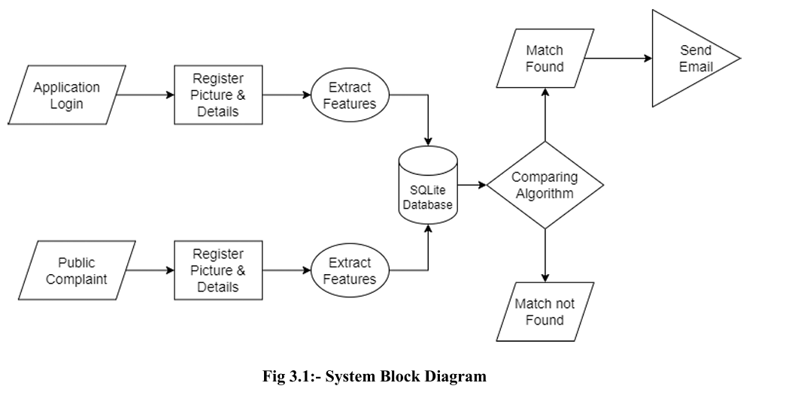

# Finding Missing Persons Using AI

This repository contains the implementation of a novel AI-based system designed to aid in the search and recovery of missing persons, particularly children. The system leverages advanced technologies such as machine learning and computer vision to identify and match missing individuals with potential sightings or available images from various sources, including surveillance cameras, social media platforms, and public databases.

## Table of Contents

- [Introduction](#introduction)
- [System Architecture](#system-architecture)
- [Implementation](#implementation)
 - [Upload Image Event](#upload-image-event)
 - [Search Image Event](#search-image-event)
 - [Virtual Environment Setup](#virtual-environment-setup)
 - [Running with Streamlit](#running-with-streamlit)
 - [Match Cases](#match-cases)
- [Flow Chart](#flow-chart)
- [System Block Diagram](#system-block-diagram)
- [Snapshots](#snapshots)
- [Usage](#usage)
- [Contributing](#contributing)
- [Contact](#contact)
- [License](#license)

## Introduction

Finding missing persons is a critical and time-sensitive task that often faces significant challenges due to the reliance on manual efforts and limited resources. This project aims to revolutionize the search and recovery process by employing artificial intelligence (AI) techniques.

The proposed AI-based system utilizes large databases of facial images and deep learning algorithms to perform facial recognition and analysis, enabling accurate comparisons between missing individuals and detected faces in the collected data.

By leveraging the potential of AI, this project contributes to the development of more effective and comprehensive solutions for finding missing persons, ultimately improving the chances of successful recoveries and enhancing overall safety and security in our society.

## System Architecture

The system architecture is designed to facilitate efficient communication and data exchange between different entities involved in the search and recovery process. The following diagram illustrates the overall architecture:


The key components of the system architecture include:

1. **User Devices**: Users can upload photos or report potential sightings of missing persons through their devices.
2. **Cloud Database**: A central cloud database stores the information and images related to missing persons and reported sightings.
3. **Police Stations**: Law enforcement agencies can access and update the database with new cases and information.

## Implementation

The implementation details of the system are described in the following sections:

### Upload Image Event

1. An existing image is uploaded by the user.
2. The upload lambda function is invoked, storing the image in the Rekognition service under a collection and obtaining a faceId.
3. The lambda function stores the faceId and other relevant details in the database.

### Search Image Event

1. An existing image is uploaded for the search event.
2. The search lambda function is invoked, triggering the search event in Rekognition.
3. The image is searched in Rekognition using the SearchFacesByImage API, and a faceId is returned in case of a successful match.
4. The lambda function uses the faceId to fetch the associated details (name, age, sex, address, etc.) from the database.

### Virtual Environment Setup

The project utilizes Python virtual environments to manage dependencies and packages. The `venv` module is used to create lightweight virtual environments, allowing for isolated and independent installations of Python packages.

### Running with Streamlit

The project leverages Streamlit, a Python-based library specifically designed for machine learning engineers, to rapidly build and share beautiful web applications. Streamlit allows for the creation of stunning applications with minimal code, making it an ideal choice for data scientists and machine learning engineers who are not web developers.

To run the application, execute the following command:
```streamlit run Home.py```

### Match Cases

The core logic of the application lies in the matching and training algorithms. A K-Nearest Neighbors (KNN) model is utilized, with the `n_neighbors` parameter set to the number of non-found cases.

The process begins by fetching embeddings data from the database for both authorized cases and public cases. The KNN model is trained using the authorized case embeddings, and predictions are made using the public case embeddings. A threshold of 0.5 is set, and if the distance between embeddings is less than the threshold, it is considered a match.

Upon finding a suitable match, the status of both the authorized case and the public case is updated in the database.

## Flow Chart

The following flow chart illustrates the overall process of the system:


## System Block Diagram

The system block diagram provides a high-level overview of the key components and their interactions within the system:




## Usage

To use the system, follow these steps:

1. Install the required dependencies by creating a virtual environment and installing the necessary packages.
2. Set up the cloud database and configure the necessary credentials and permissions.
3. Run the application using the provided Streamlit command.
4. Upload images or report potential sightings through the user interface.
5. The system will perform facial recognition and analysis, comparing the uploaded images with the database of missing persons.
6. If a match is found, the relevant authorities will be notified, and the details of the potential sighting will be shared.

## Contributing

Contributions to this project are welcome. If you find any issues or have suggestions for improvements, please open an issue or submit a pull request.

## License

This project is licensed under the [MIT License](LICENSE).


